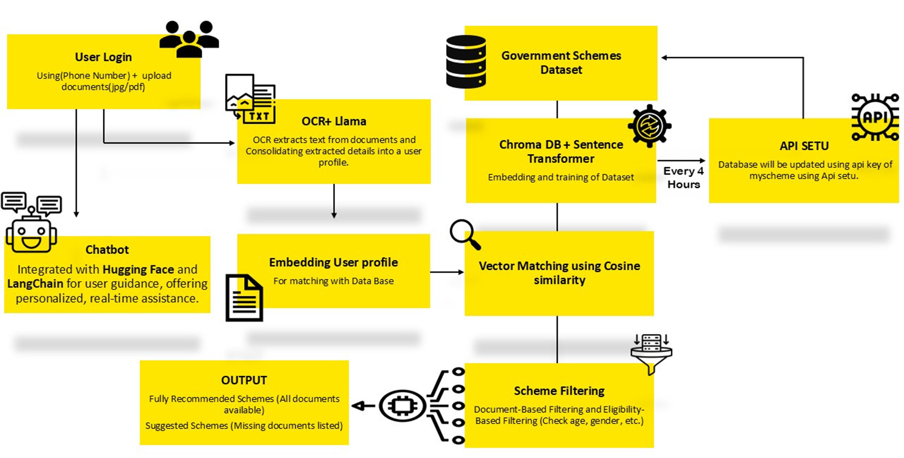

# AI-Powered Platform for Streamlined Access to Government Schemes (SchmeSaathi)

---

Video Link : [https://drive.google.com/drive/folders/13FLs1phKQ8f9wYZBmXN0eV-1LfwwfNSl?usp=drive_link](https://drive.google.com/drive/folders/13FLs1phKQ8f9wYZBmXN0eV-1LfwwfNSl?usp=drive_link)

Repository Link : [https://github.com/indu-shekhar/SchemeSaathi](https://github.com/indu-shekhar/SchemeSaathi)

## 🛠️ **Problem Identified**

### Key Challenges:

1. 🎯 **Scattered Information**
    
    Citizens struggle to find relevant scheme details as they are spread across various platforms.
    
2. ⚙️ **Complex Eligibility Requirements**
    
    Understanding eligibility criteria and required documents can be daunting.
    
3. 🌍 **Language Barriers**
    
    Limited multilingual support prevents rural and underserved communities from accessing schemes.
    
4. 🚧 **Cumbersome Processes**
    
    Inefficient application workflows make it difficult to secure benefits.
    

These challenges result in many citizens missing out on critical opportunities to improve their lives.

---

## 🚀 **Methodology**

### 💡 **Value Proposition**

Our platform tackles these challenges by:

- **Simplifying Access**: Consolidating information on over 2,500 schemes for easier discovery.
- **Personalized Recommendations**: Using AI-driven matching based on user profiles.
- **Enhanced Accessibility**: Providing multilingual and voice-enabled chatbot support for inclusivity.

---

### 📌 **Our Approach**

### 1️⃣ **User-Friendly Interface**

- Secure login with phone numbers and OTP verification.

### 2️⃣ **Document Processing**

- OCR technology extracts data from documents for automated profile creation.

### 3️⃣ **Scheme Matching**

- Advanced SentenceTransformer embeddings and ChromaDB vector search.

### 4️⃣ **Dynamic Updates**

- Real-time synchronization of scheme information.

### 5️⃣ **Chatbot Assistance**

- Multilingual, voice-enabled chatbot for personalized guidance.

---

### 🔧 **Technologies Used**

| **Technology** | **Details** |
| --- | --- |
| **Backend** | Flask, Python |
| **AI Components** | SentenceTransformer, ChromaDB, Meta-Llama-3-8B-Instruct |
| **Frontend** | HTML, JavaScript, Tailwind CSS |
| **Conversational AI** | LangChain, Hugging Face |
| **Additional Tools** | OCR for document extraction |

---

## 🌈 **Addressal of the Problem**

Our platform solves these issues by:

1. **Scattered Information**: Offering a centralized data repository.
2. **Complex Eligibility**: Using AI to analyze user profiles and suggest schemes dynamically.
3. **Language Barriers**: Empowering non-native speakers with multilingual, voice-enabled chatbots.
4. **Cumbersome Processes**: Simplifying workflows for smooth user experiences.

📊 **Impact Metrics**

- **⏱️ Time-Saving**: Faster identification of relevant schemes.
- **🌐 Accessibility**: Increased inclusivity for diverse language users.

---

## 💰 **Financial Outlay**

| **Component** | **Estimated Cost (INR)** |
| --- | --- |
| AI Model Development | 15,000 |
| Backend & Frontend Development | 10,000 |
| Database Integration | 5,000 |
| Multilingual Chatbot** | 35,000 |
| Infrastructure (Servers, APIs) | 15,000 |
| Marketing & Outreach** | 30,000 |
| Contingency | 2,000 |
| **Total** | **47,000** |

---

## Timeline

| **Phase** | **Duration** | **Activities** |
| --- | --- | --- |
| **Phase 1: Planning** | 1 month | Requirement analysis, stakeholder consultation, and project roadmap creation. |
| **Phase 2: Development** | 3 months | Backend, frontend, AI model development, and database integration. |
| **Phase 3: Testing** | 2 months | Functional, user acceptance, and performance testing. |
| **Phase 4: Deployment** | 1 month | Platform launch and initial user feedback collection. |
| **Phase 5: Optimization** | Continuous | Feedback-based refinements and feature upgrades. |

Members: 

Indu Shekhar Jha (122CS0076)

Ananya Srivastav (122CS0077)

Abhishek kumar (122AD0039)
